<div align="center">

# Vantage

### Your unfair advantage in job searching.

Vantage is an AI job-application platform for university students and new grads. It reads a job posting, tailors your resume to it, scores that resume the way an applicant tracking system would, writes the cover letter, drafts the outreach, preps the interview, and tracks every application - all in one workspace.

Built by **Ishvir Chopra**.


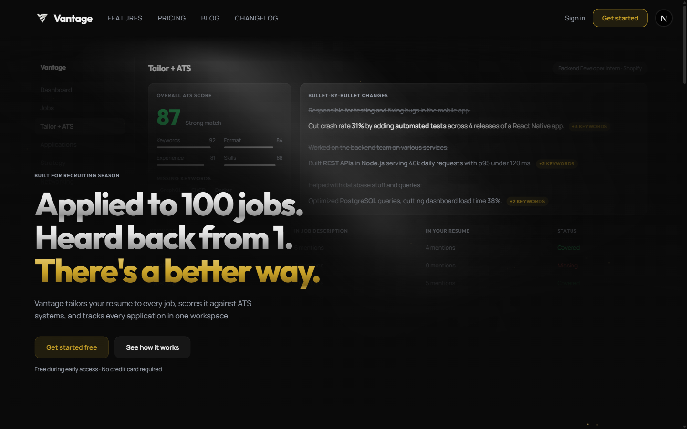

</div>

---

## The problem

> **Applied to 100 jobs. Heard back from 1.**

Most students send the same resume to every posting. Recruiting software screens most of them out before a human ever looks - for keywords they never included and formatting they never checked. Vantage closes that gap: it makes every application specific to the role, tells you your odds *before* you apply, and keeps the whole search organized in one place so effort compounds instead of scattering.

---

## What makes it different

Vantage is **not a GPT wrapper**. Every AI action is built on top of a single intelligence layer - `buildUserContext()` - which assembles your profile, base resume, full application history, and past ATS performance into a dense context block that is injected into *every* prompt.

That means the tailoring, the cover letters, the strategy feedback, and the interview questions all get sharper as you use the product. The system already knows which roles you convert on, where your resume is thin, and how you've scored against real postings - so it stops giving generic advice and starts giving *yours*.

---

## Features

### Tailor + ATS - the core loop

Paste a job URL (or the description). Vantage parses it into structured requirements, rewrites your resume to match, and scores the result against what screening software actually looks for - **keywords, experience, format, and skills** - with the exact terms you're missing and concrete fixes. Nothing is charged until a step succeeds, and each result tab (score, tailored resume, cover letter) runs on its own.

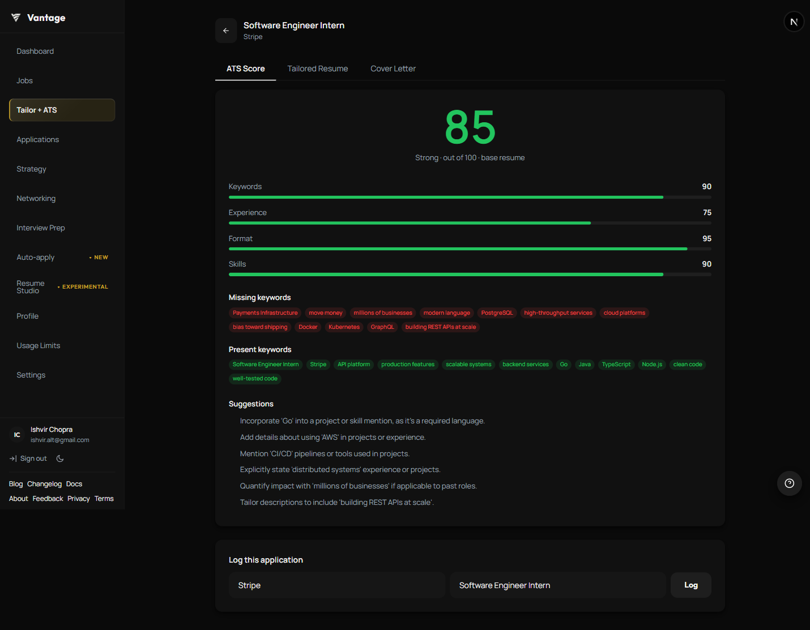

### Application Tracker

Every application in one table - status, days since applied, and the ATS score you earned for that role. Response rate and active-interview counts are computed live.

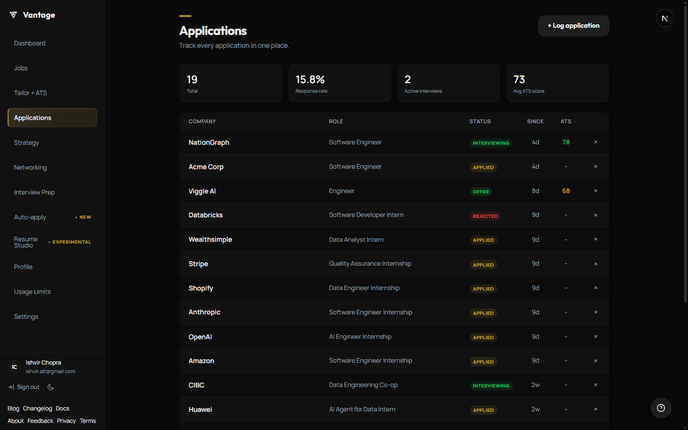

### Dashboard

The at-a-glance view: total applications, response rate, active interviews, average ATS score, recent activity, and score history.

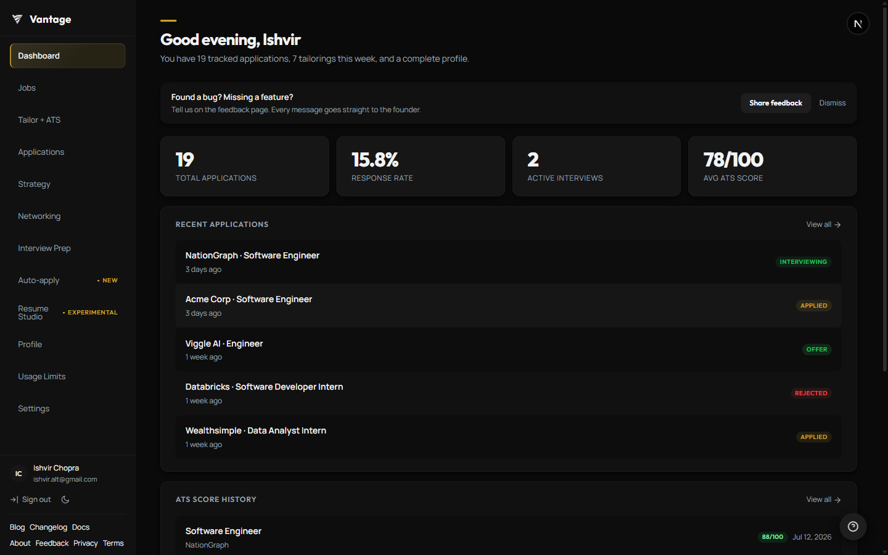

### Strategy

AI feedback on the *whole* search, not a single resume. It reads your history and ATS data to tell you where to **focus**, where to **stop applying**, how your interview-stage scores compare to your average, and what to do next.

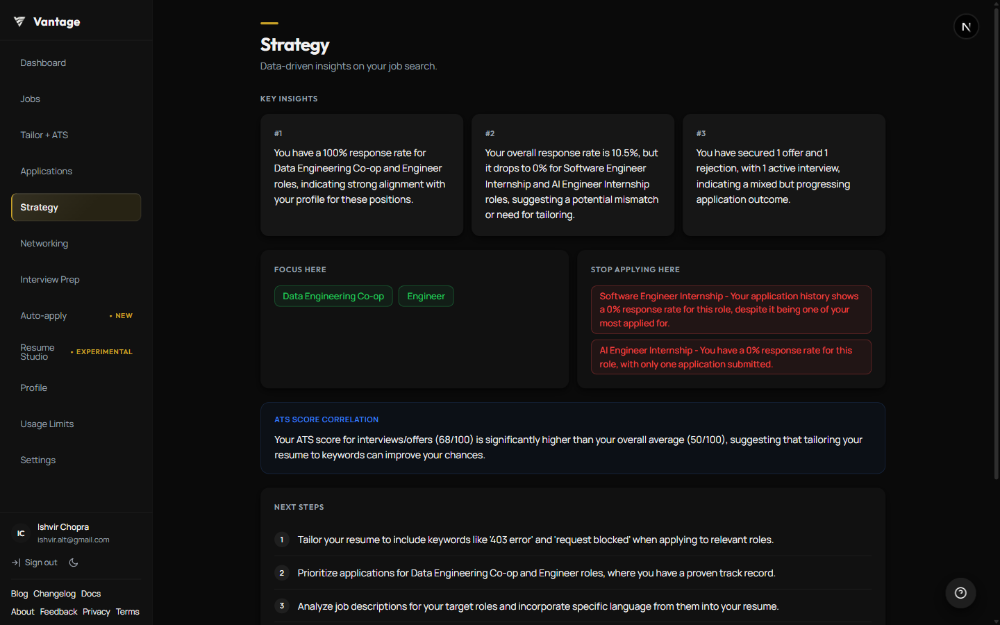

### Job Feed

Personalized listings matched to your target roles (via Adzuna), with a relevance score per posting, location and type filters, saved filter presets, and a one-click jump straight into Tailor + ATS.

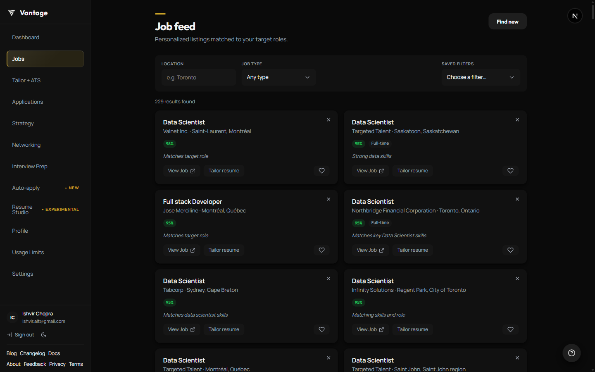

### Networking

Find contacts at a company, then generate LinkedIn connection requests (kept under 280 characters), cold emails, and follow-ups - all in your voice. Refine any draft with a plain-English instruction, and track what you've sent.

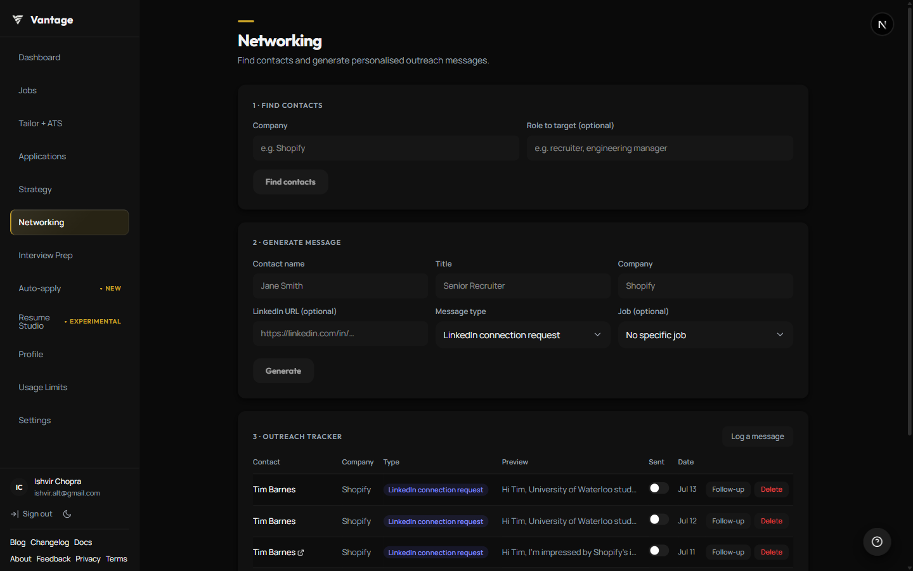

### Interview Prep

Generates questions from a specific job's real requirements. Answer by voice or by typing, and get scored feedback with concrete strengths and fixes. Sessions are saved so you can resume them.

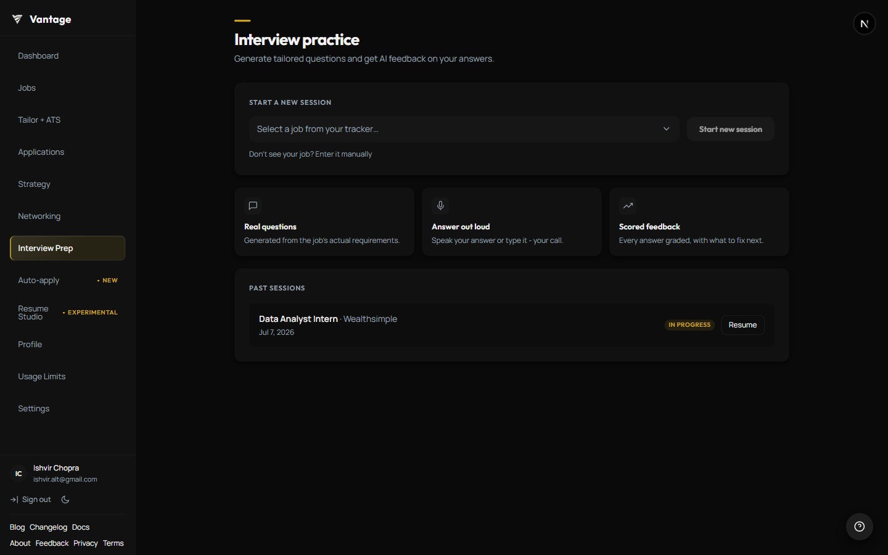

### Auto-apply

Fills application forms for you and **never submits** - you always review first. Powered by the [Vantage Auto-Fill Chrome extension](https://chromewebstore.google.com/detail/vantage-auto-fill/mgapanbbaplohlojbmghoglmpfpogook):

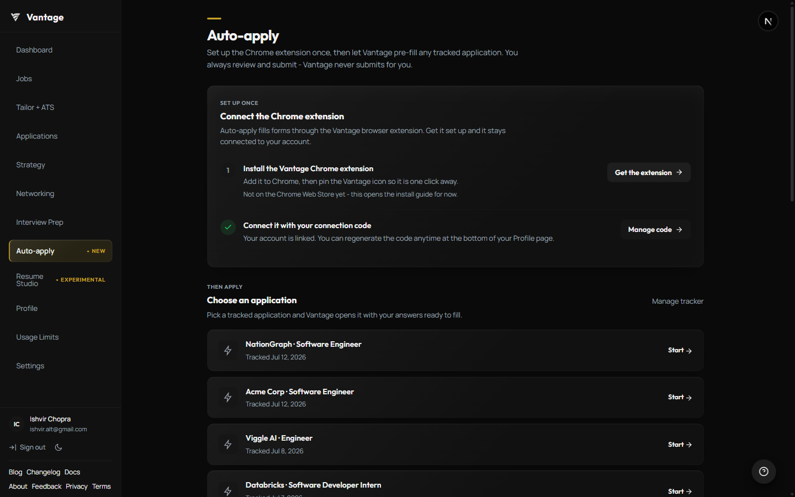

The extension in action, filling a real Lever form - data injected, nothing submitted:

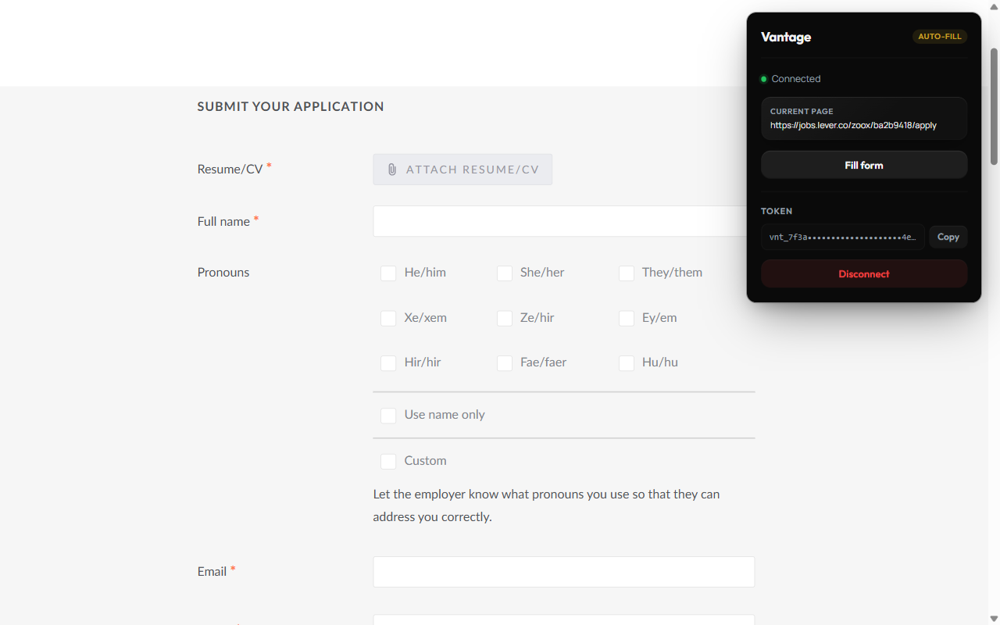

### Resume Studio *(experimental)*

Open a tailored or uploaded resume, tell the AI what to change one instruction at a time (*"cut the summary to two lines"*), and watch a live preview update. Download to PDF with your original hyperlinks preserved.

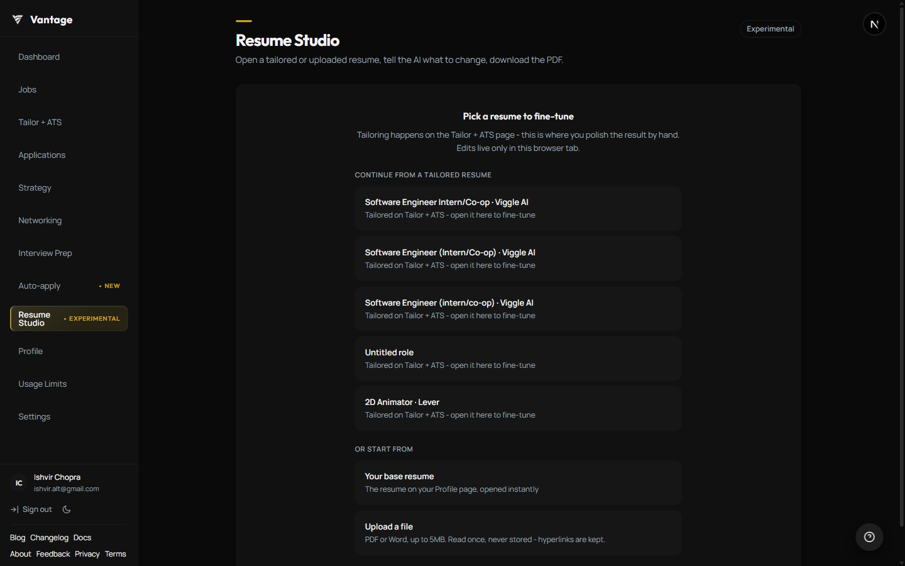

---

## How a single AI request works

Every protected AI route follows the same disciplined lifecycle - auth → validate → read limits → do the work → **charge only on success** → log:

```
Request
  → requireAuth()                     guard the route
  → validateBody()                    reject bad input for free
  → checkLimit()                      read-only freemium gate
  → buildUserContext(userId)          assemble the intelligence layer
  → withTimeout(generateJSON<T>(), 30s)   Gemini call, wrapped
  → consumeLimit() + recordRateLimitUse() + logRoute()   success only
  → ok({ result })
```

Failed generations (AI errors, timeouts, DB failures) never burn a user's credit. All AI traffic funnels through a single wrapper (`lib/ai.ts`) with retry/backoff and a **platform-wide monthly call budget** - a hard kill switch that caps total spend regardless of how many people sign up.

---

## Architecture

| Layer | Technology |
|---|---|
| Framework | Next.js 16 (App Router, React 19) |
| Language | TypeScript (strict, no `any`) |
| Styling | Tailwind CSS + CSS variables |
| Database | Supabase (PostgreSQL, row-level security on every table) |
| Auth | Supabase Auth (email/password + Google) |
| File storage | Supabase Storage |
| AI | Google **Gemini 2.5 Flash-Lite**, wrapped entirely in `lib/ai.ts` |
| Payments | Stripe (feature-flagged) |
| Email | Resend |
| Extension | Chrome Manifest V3 (separate codebase in `/extension`) |
| Hosting | Vercel |

**By the numbers:** 43 API routes · ~35 shared UI components · 18 dashboard pages · property-based tests (fast-check) on the tricky logic (auto-fill, changelog ordering, job filters, interview scoring).

```
/app
  (auth)         login, signup - public
  (dashboard)    the protected app - 18 feature pages
  (marketing)    landing, blog, changelog, docs, legal - public
  admin          analytics, ADMIN_USER_ID only
  api            43 route handlers
/lib             ai, userContext, rateLimit, requireAuth, pdf, email …
/components      shared UI (Spinner, EmptyState, Toast, ScoreBadge …)
/content         MDX blog + append-only changelog
/extension       Chrome extension (Manifest V3)
```

### Design principles baked into the codebase

- **The provider stays swappable** - no AI SDK is imported anywhere except `lib/ai.ts`, so changing models is a one-file edit.
- **Server/client boundaries are strict** - the service-role key never touches client code; browser and server Supabase clients are never mixed.
- **Real states everywhere** - spinners inside buttons, skeleton loaders on data sections, and an explicit empty state for every list.
- **A feature flag runs the economics** - with `ENABLE_FREEMIUM=false`, limit checks short-circuit to *unlimited* with zero database calls (development mode); flip it on and the free tier + Stripe paywall activate.

---

## Design system

A dark-glass material system: near-black surfaces, borderless cards, compact pill badges, and a single restrained accent - gold (`#c9a227`) - reserved for the headline, the primary CTA, and the "applied" states. Dark mode is the default; light mode ships via `[data-theme="light"]`. Twelve-pixel radii, a 16px spacing base, no gradients, no emoji in the UI, no dead links.

```
--bg #0a0a0a   --card #111111   --text #f2f2f2
--muted #9ca3af   --border #1f1f1f   --accent #f2f2f2
--radius 12px
```

---

## Pricing

| Feature | Free - $0/mo | Pro - $8/mo CAD |
|---|---|---|
| Resume tailorings | 10 / month | 150 / month |
| Cover letters | 10 / month | 120 / month |
| Auto-apply credits | 20 / month | 300 / month |
| Application tracking | 150 total | Unlimited |
| Strategy feedback | 2 / month | 30 / month |
| Networking drafts | 15 / month | 250 / month |
| Interview prep | 5 / month | 150 / month |
| Support | Email | Priority |

---

<div align="center">

**Vantage** - Your unfair advantage in job searching.

Built by Ishvir Chopra

</div>
